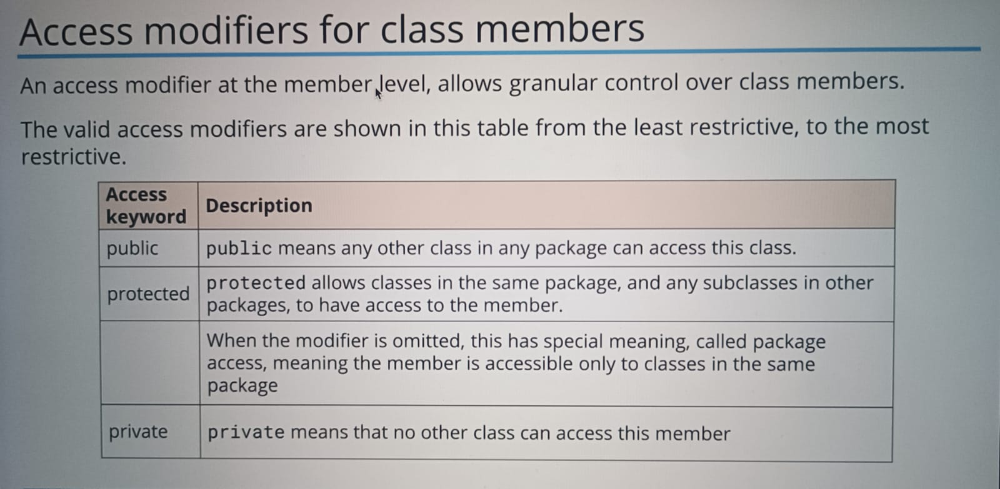

# Inheritance

## Object

Objects have two major components:

1. State
2. Behavior

States are nothing but properties or attributes. And behavior are nothing but methods.
These are fundamental parts of object oriented programming.
Classes are blueprints for creating objects.
Static methods are class specific and affect every object id changed by one object
Non static methods are object specific and only be called by objects

## Classes

1. The word **public class ClassName** means any other class from any other package can acces this class
2. When access modifier is not implicitaly specified, by default class or any variable is considered private.
3. And private class means only classes present in same package can access class.
4. More on access modifiers



## Encapsulation

1. Bundling behavior of attributes on single object
2. The other practice of hiding fields, and some methods, from public access

```
The default value of
int, byte, long is 0.
float, double is 0.0
byte is false.
And String is null
```
